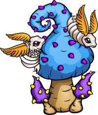

# js-animation-game

This repository containes the code for a nice and fun browser game, entirely written in javascript.
It will have nice sprites, animations and even simple physics.

## State of the game
**ALPHA**

Currently there is a very basic version of the game.
You can open it and maybe move things around but there is very limited actual gameplay right now.
You can try to move the eggs and also bully the enemies as they try to reach the left side of the map.

The next state will be the **BETA** state. Here you can expect basic gameplay (limited to core principles and with lots of bugs) for the first time.

**Expect new features**
- Larvas will hatch from eggs!
- Your goal is to protect these larvas - why? Because green watcher enemies likes larvas, yummmi! :meat_on_bone:

You can expect this happen in march 2023. Stay tuned!

## Changelog

**Updates 04.03.2023**
- Larvas are now get physics and react to obstacles (player can push them around like eggs)
- Green watcher enemies can (and will!) eat our precious larvas on contact
- A basic score board is available - when larvas reach the safe and cosy forrest, you get one point

**Updates 02.03.2023**
- Enemies gets simple physics & react to obstacles: 
    - Pushing eggs around
    - find their way around obstacles
    - can be pushed by the player
- Welcome to the larvas!

 

- They are now hatching from the eggs and try to find there way to the forrest.
- They ignore obstacles for now and directly move the upper region of the game map
- Two debug features for these larvas where added - a hatchtimer and their collision circles

**Updates 24.02.2023**
- Eggs have collision physics & can be pushed around by the player
- game objects like obstacles, player or eggs are drawn based on the vertical position, so that a 3D illusion is created
- The game has basic enemy creatures which fly through the forrest

**Updates 21.02.2023**
- Add a simple static sprite for the player character "blue bull" centered over the player hitbox circle
- Animated sprite for the player character for eight directions while moving
- Simple debug mode - by pressing "D" in keyboard the player can hide / show the hitboxes
- Horizontal & vertical boundaries 

**Updates 20.02.2023**
- Fantasy themed background (magic forrest sprite)
- a player placeholder circle spawning in the middle of the map
- random obstacles (also placeholder circles)
- player can move with the mouse by clicking on the map or holding the mouse button down
- a simple line is showing the direction the player is moving
- obstacle placing follows simple rules to always match the game area and let enough space for the player to move around them
- obstacles have random sprites from the sprite sheet and thus more variance
- basic collision detection between player and obstacles and display a collision to the js console
- simulate basic physics by making obstacles solid and let player move around them automaticaly instead of crossing them

## How to run this game
Just try it [online](https://erikuckert.github.io/js-animation-game/) or clone to your local drive and open the [index.html](index.html) with your webbrowser.

## Credits
This game is based on the awesome work of [Frantisek Dvorak](https://www.youtube.com/@Frankslaboratory/featured).
It will initially use also his sprites but will eventually evolve with some other sprites or different mechanics.